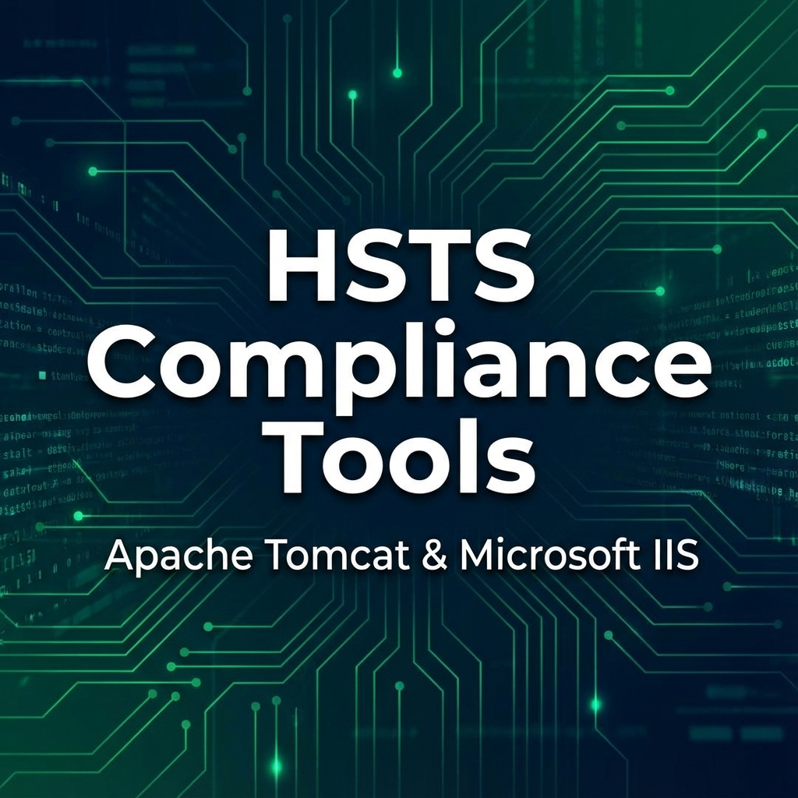

<div align="center">



# HSTS Compliance Suite
### Enterprise-Grade Security Automation for Apache Tomcat & Microsoft IIS

[](LICENSE)
[](docs/INSTALLATION.md)
[](docs/PROJECT_STATUS.md)
[](docs/SECURITY.md)

</div>

<p align="center">
  <b>🛡️ Automate. Secure. Comply.</b><br>
  The professional solution for auditing and enforcing HTTP Strict Transport Security (HSTS) headers across mixed enterprise server fleets.
</p>

<p align="center">
  <a href="#-one-line-quick-start">🚀 Quick Start</a> •
  <a href="docs/INSTALLATION.md">📚 Installation</a> •
  <a href="docs/API_INTEGRATION.md">📊 SIEM Integration</a> •
  <a href="docs/VERIFICATION.md">✅ Verification</a>
</p>

---

**Primary Purpose:** This project eliminates configuration drift and ensures OWASP HSTS compliance by providing automated auditing, self-healing configuration, and enterprise-grade reporting for Linux and Windows infrastructure.

## 📋 Platform Support Matrix

| Platform | Server Type | Supported | Script Location |
|----------|-------------|-----------|-----------------|
| **Windows** | IIS | ✅ | `src/windows/UpdateIisHstsWin.ps1` |
| **Windows** | Apache Tomcat | ✅ | `src/windows/UpdateTomcatHstsWin.ps1` |
| **Linux/Unix** | Apache Tomcat | ✅ | `src/unix/UpdateTomcatHstsUnix.sh` |
| **Linux/Unix** | IIS | ❌ | N/A |

**Supported Linux Distributions:** Ubuntu, Debian, Kali, RHEL, CentOS, and other Unix-like systems

**Supporting Tools:** Installation scripts are provided to help set up test environments, but the core functionality is HSTS security configuration.

---

## 🚀 One-Line Quick Start

### Linux/Unix - Tomcat Audit

```bash
# Download latest release and run audit
curl -sSL https://github.com/ZeroXSHDW/HSTS_Compliance_Apache-Tomcat_IIS/releases/latest/download/HSTS_Compliance.tar.gz | \
  sudo tar -xz && cd HSTS_Compliance_Apache-Tomcat_IIS-* && \
  sudo ./src/unix/UpdateTomcatHstsUnix.sh --mode audit
```

### Windows - Tomcat Audit (Local)

```powershell
# Download latest release and run audit (Run as Administrator)
Invoke-WebRequest -Uri "https://github.com/ZeroXSHDW/HSTS_Compliance_Apache-Tomcat_IIS/releases/latest/download/HSTS_Compliance.zip" -OutFile "$env:TEMP\HSTS.zip"
Expand-Archive -Path "$env:TEMP\HSTS.zip" -DestinationPath "$env:TEMP\HSTS" -Force
Set-Location "$env:TEMP\HSTS\HSTS_Compliance_Apache-Tomcat_IIS-*"
.\src\windows\UpdateTomcatHstsWin.ps1 -Mode audit
```

### Windows - IIS Audit (Local)

```powershell
# Download latest release and run audit (Run as Administrator)
Invoke-WebRequest -Uri "https://github.com/ZeroXSHDW/HSTS_Compliance_Apache-Tomcat_IIS/releases/latest/download/HSTS_Compliance.zip" -OutFile "$env:TEMP\HSTS.zip"
Expand-Archive -Path "$env:TEMP\HSTS.zip" -DestinationPath "$env:TEMP\HSTS" -Force
Set-Location "$env:TEMP\HSTS\HSTS_Compliance_Apache-Tomcat_IIS-*"
.\src\windows\UpdateIisHstsWin.ps1 -Mode audit
```

### Windows - Remote Execution (Tomcat)

```powershell
# Download and execute remote audit on multiple servers (Run as Administrator)
Invoke-WebRequest -Uri "https://github.com/ZeroXSHDW/HSTS_Compliance_Apache-Tomcat_IIS/releases/latest/download/HSTS_Compliance.zip" -OutFile "$env:TEMP\HSTS.zip"
Expand-Archive -Path "$env:TEMP\HSTS.zip" -DestinationPath "$env:TEMP\HSTS" -Force
Set-Location "$env:TEMP\HSTS\HSTS_Compliance_Apache-Tomcat_IIS-*"
$cred = Get-Credential
.\src\windows\Remote_UpdateTomcatHstsWin.ps1 -ServerName "webserver01.example.com" -Mode audit -Credential $cred
```

### Windows - Remote Execution (IIS)

```powershell
# Download and execute remote audit on multiple servers (Run as Administrator)
Invoke-WebRequest -Uri "https://github.com/ZeroXSHDW/HSTS_Compliance_Apache-Tomcat_IIS/releases/latest/download/HSTS_Compliance.zip" -OutFile "$env:TEMP\HSTS.zip"
Expand-Archive -Path "$env:TEMP\HSTS.zip" -DestinationPath "$env:TEMP\HSTS" -Force
Set-Location "$env:TEMP\HSTS\HSTS_Compliance_Apache-Tomcat_IIS-*"
$cred = Get-Credential
.\src\windows\Remote_UpdateIisHstsWin.ps1 -ServerName "webserver01.example.com" -Mode audit -Credential $cred
```

> **Note:** For production use, clone the repository instead of using one-liners to ensure version control and easier updates.

## Table of Contents

- [Overview](#overview)
- [Project Structure](#project-structure)
- [Prerequisites](#prerequisites)
- [Installation Instructions](#installation-instructions)
- [Quick Start](#quick-start)
- [Mode Reference](#mode-reference)
- [Usage Examples](#usage-examples-with-output)
- [Auto-Detection](#auto-detection)
- [Command Reference](#command-reference)
- [Exit Codes](#exit-codes)
- [Security Notes](#security-notes)
- [Troubleshooting](#troubleshooting)
- [Best Practices](#best-practices)
- [Testing](#testing)
- [Advanced Usage](#advanced-usage)
- [PowerShell Remoting (WinRM) Setup Guide](#powershell-remoting-winrm-setup-guide)
- [Code Review Summary](#code-review-summary)
- [Security Policy](SECURITY.md)
- [Code of Conduct](CODE_OF_CONDUCT.md)
- [License](#license)
- [Contributing](#contributing)

## Overview

This project provides scripts to audit and configure HSTS headers for compliance with security best practices as defined in the **OWASP HSTS Cheat Sheet** (RFC 6797).

**OWASP Recommended Configuration:**

```http
Strict-Transport-Security: max-age=31536000; includeSubDomains
```

**Reference:** [OWASP HSTS Cheat Sheet](https://cheatsheetseries.owasp.org/cheatsheets/HTTP_Strict_Transport_Security_Cheat_Sheet.html)

### Compliance Requirements

This implementation follows OWASP recommendations:

- ✅ **Required**: `max-age=31536000` (1 year = 365 days × 24 hours × 60 minutes × 60 seconds)
- ✅ **Required**: `includeSubDomains` (prevents cookie-related attacks from subdomains)
- ℹ️ **Optional**: `preload` directive (allowed but not configured by default - see [Preload Considerations](#preload-considerations) below)

**Key Features:**

**Core Functionality:**

- ✅ **Auto-Detection**: Automatically finds Tomcat and IIS installations across common paths
- ✅ **Audit Mode**: Check if HSTS is correctly configured without making changes

  - ✅ Windows Tomcat: `UpdateTomcatHstsWin.ps1 -Mode audit`
  - ✅ Windows IIS: `UpdateIisHstsWin.ps1 -Mode audit`
  - ✅ Linux/Unix Tomcat: `UpdateTomcatHstsUnix.sh --mode audit`
- ✅ **Configure Mode**: Automatically fix HSTS configuration to be OWASP compliant
  - ✅ Windows Tomcat: `UpdateTomcatHstsWin.ps1 -Mode configure`
  - ✅ Windows IIS: `UpdateIisHstsWin.ps1 -Mode configure`
  - ✅ Linux/Unix Tomcat: `UpdateTomcatHstsUnix.sh --mode configure`
- ✅ **Backup Support**: Automatically creates timestamped backups before making changes
- ✅ **Dry Run**: Preview changes without applying them (configure mode only)
- ✅ **XML Validation**: Validates XML structure before and after modifications
- ✅ **Idempotency**: Ensures exactly one compliant HSTS definition (removes duplicates)

**Flexibility & Control:**

- ✅ **Custom Paths**: Specify single or multiple custom configuration paths
- ✅ **Paths File Support**: Load multiple paths from a file (one per line, comments supported)
- ✅ **Multiple File Processing**: Automatically processes all web.xml/web.config files in detected installations
- ✅ **Selective Processing**: Target specific files or directories as needed
- ✅ **Environment Variable Support**: Unix scripts check CATALINA_BASE and CATALINA_HOME

**Remote & Enterprise Features:**
- ✅ **Remote Execution**: Windows scripts support remote execution via PowerShell Remoting (WinRM)
- ✅ **Server List Files**: Execute on multiple servers using server list files (comments supported)
- ✅ **Consolidated Reporting**: Remote scripts generate a single master report (JSON/CSV) for the entire server fleet
- ✅ **Enterprise JSON Output**: All scripts support machine-readable JSON output for SIEM/dashboard integration
- ✅ **Automated Report Generation**: Save detailed audit results to specified files for archival and compliance
- ✅ **Multi-Instance Detection**: Comprehensive discovery of all Tomcat/IIS instances on a single host

**Platform & Compatibility:**
- ✅ **Cross-Platform**: Bash scripts for Unix/Linux servers, PowerShell for Windows Server
- ✅ **Version Support**: Works with all versions of Tomcat (7.0+) and IIS (7.0+), including Tomcat 11.0 and native IIS 10.0+ HSTS management
- ✅ **HSTS Configuration Support:**
  - **Linux/Unix:** Apache Tomcat only
  - **Windows:** Apache Tomcat and Microsoft IIS
- ✅ **Supporting Installation Scripts**: Automated Tomcat and IIS installation scripts are provided as supporting tools for setting up test environments (Windows: Tomcat & IIS, Unix/Linux: Tomcat only)
- ✅ **Java Auto-Installation**: Installation scripts automatically install required Java versions

**Quality & Safety:**
- ✅ **Test Suite**: Comprehensive test scripts for validating HSTS patching functionality (5 scenarios Windows, 4 scenarios Unix)
- ✅ **Logging**: Detailed logging to files and console with timestamps and hostname
- ✅ **Error Handling**: Comprehensive error handling with clear exit codes (0=success, 1=failure, 2=error)
- ✅ **Security Validations**: Path traversal protection, null byte detection, symlink/junction detection, permission checks
- ✅ **User Confirmation**: Interactive prompts for destructive operations (can be bypassed with `-Force`)
- ✅ **Force Mode**: Auto-approve all changes without prompting (useful for automation)
- ✅ **Example Files**: Provided example configuration files for testing

## Project Structure

```
.
├── README.md                    # Main documentation (this file)
├── LICENSE                      # MIT License
├── CONTRIBUTING.md              # Contribution guidelines
├── CHANGELOG.md                 # Project changelog
├── SECURITY.md                  # Security policy
├── CODE_OF_CONDUCT.md           # Community standards
├── VERSION                      # Current version file
├── quick-start.sh               # One-line quick start script
├── docs/                        # Project documentation
│   ├── INSTALLATION.md          # Installation guide
│   ├── VERIFICATION.md          # HSTS verification guide
│   ├── API_INTEGRATION.md       # API & SIEM integration
│   ├── JSON_SCHEMA.md           # JSON output schema
│   ├── INTERNATIONALIZATION.md  # I18N guide
│   └── PROJECT_STATUS.md        # Current project status
├── assets/                      # Project assets
│   └── images/
│       └── banner.png           # Project banner image
├── install/                     # Supporting installation scripts (for test environments)
│   ├── README.md               # Installation script documentation
│   ├── windows/
│   │   ├── TomcatManager.ps1   # Windows Tomcat installation script (supports 7.0, 8.5, 9.0, 10.0, 10.1)
│   │   ├── Remote_TomcatManager.ps1  # Remote Tomcat installation script
│   │   ├── IisManager.ps1      # Windows IIS installation script
│   │   └── Remote_IisManager.ps1      # Remote IIS installation script
│   └── unix/
│       └── tomcat_manager.sh   # Unix/Linux Tomcat installation script (supports 7.0, 8.5, 9.0, 10.0, 10.1)
├── src/                         # PRIMARY: HSTS security configuration scripts
│   ├── unix/
│   │   └── UpdateTomcatHstsUnix.sh    # Linux/Unix Tomcat HSTS configuration (auto-detect, custom paths)
│   └── windows/
│       ├── UpdateTomcatHstsWin.ps1           # Windows Tomcat HSTS configuration (local execution)
│       ├── Remote_UpdateTomcatHstsWin.ps1    # Windows Tomcat HSTS configuration (remote execution)
│       ├── UpdateIisHstsWin.ps1              # Windows IIS HSTS configuration (local execution)
│       └── Remote_UpdateIisHstsWin.ps1       # Windows IIS HSTS configuration (remote execution)
├── reports/                      # Directory for generated enterprise reports (created automatically)
├── tests/                       # Test scripts for HSTS patching
│   ├── README.md               # Test documentation and usage guide
│   ├── windows/
│   │   └── test_hsts_win.ps1   # Windows HSTS tests (Tomcat and IIS, 5 scenarios)
│   └── unix/
│       └── test_hsts_unix.sh   # Unix/Linux HSTS tests (Tomcat, 4 scenarios)
└── examples/                    # Example configuration files for testing
    ├── README.md               # Examples usage guide
    ├── test_web.xml            # Example Tomcat web.xml (minimal configuration)
    ├── test_web.config         # Example IIS web.config (minimal configuration)
    └── web.xml                 # Additional Tomcat web.xml example
```

## Prerequisites

### For Tomcat (Unix/Linux Servers)

- Bash shell (version 3.2+)
- Apache Tomcat installed (version 7.0 or later)

- Root or sudo access for configuration changes
- Optional: `xmllint` for XML validation, `diff` for dry-run preview
- **Note:** Scripts are designed for Linux/Unix server environments only (not macOS)

### For Tomcat (Windows Server)

- PowerShell 5.1 or later
- Apache Tomcat installed (version 7.0 or later)

- Administrator privileges
- For remote execution: PowerShell Remoting (WinRM) enabled and configured

### For IIS (Windows Server)

- PowerShell 5.1 or later
- IIS installed (version 7.0 or later)

- Administrator privileges
- For remote execution: PowerShell Remoting (WinRM) enabled and configured

## Installation Instructions

> **Note:** The installation scripts in the `install/` directory are **supporting tools** provided to help set up test environments. The **primary purpose** of this project is HSTS security configuration. If you already have Tomcat or IIS installed, you can proceed directly to the [Quick Start](#quick-start) section to configure HSTS.

### Automated Installation (Supporting Tools)

For automated installation of Apache Tomcat or IIS on Windows or Unix/Linux systems, use the installation scripts provided in the `install/` directory. These scripts handle download, extraction, Java setup, secure user configuration, and service management.

**Supported Installations:**

- **Windows:** Tomcat (7.0, 8.5, 9.0, 10.0, 10.1) and IIS
- **Unix/Linux:** Tomcat (7.0, 8.5, 9.0, 10.0, 10.1)

**Windows:**

```powershell
# Run as Administrator
cd install\windows
.\TomcatManager.ps1 -Action install -TomcatVersion 10.1
```

**Unix/Linux:**
```bash
# Run as root or with sudo
cd install/unix
sudo ./tomcat_manager.sh -v 10.1
```

See [install/README.md](install/README.md) for full installation script documentation and usage examples, including remote installation support.

### Manual Installation

For detailed manual installation instructions for Apache Tomcat, IIS, and PowerShell Remoting configuration, please see the **[docs/INSTALLATION.md](docs/INSTALLATION.md)** file.

**Quick Summary:**
- **Apache Tomcat**: Download Windows Service Installer from https://tomcat.apache.org or use the installation scripts
- **IIS**: Install via PowerShell: `Install-WindowsFeature -Name Web-Server -IncludeManagementTools`
- **PowerShell Remoting**: Enable on target servers: `Enable-PSRemoting -Force` and configure firewall rules

See [docs/INSTALLATION.md](docs/INSTALLATION.md) for complete step-by-step instructions, troubleshooting guides, and verification checklists.

> **After Installation:** Once Tomcat or IIS is installed, proceed to the [Quick Start](#quick-start) section to configure HSTS security headers.

    
## Quick Start

> **Primary Purpose:** The main functionality of this project is HSTS security configuration. Use the scripts below to audit and configure HSTS headers for OWASP compliance.

### Apache Tomcat (Unix/Linux - including Kali)

**Audit Mode - Check HSTS Configuration:**
```bash
# Auto-detect and audit
sudo ./src/unix/UpdateTomcatHstsUnix.sh --mode audit

# Audit with custom path
sudo ./src/unix/UpdateTomcatHstsUnix.sh --mode audit --custom-conf=/opt/tomcat/conf
```

**Configure Mode - Fix HSTS Configuration:**
```bash
# Auto-detect and configure
sudo ./src/unix/UpdateTomcatHstsUnix.sh --mode configure

# Configure with custom path
sudo ./src/unix/UpdateTomcatHstsUnix.sh --mode configure --custom-conf=/opt/tomcat/conf

# Preview changes without applying (dry run)
sudo ./src/unix/UpdateTomcatHstsUnix.sh --mode configure --dry-run
```

**With Custom Path:**
```bash
sudo ./src/unix/UpdateTomcatHstsUnix.sh --mode configure --custom-conf=/opt/tomcat/conf
```

**With Multiple Custom Paths:**
```bash
sudo ./src/unix/UpdateTomcatHstsUnix.sh --mode configure \
  --custom-conf=/opt/tomcat1/conf \
  --custom-conf=/opt/tomcat2/conf
```

**With Custom Paths File:**
```bash
# Create paths file: /etc/tomcat-paths.txt
# /opt/tomcat1/conf
# /opt/tomcat2/conf
# /opt/tomcat3/conf

sudo ./src/unix/UpdateTomcatHstsUnix.sh --mode configure \
  --custom-paths-file=/etc/tomcat-paths.txt
```

### Apache Tomcat (Windows)

**Audit Mode - Check HSTS Configuration:**
```powershell
# Local execution - Auto-detect and audit
.\src\windows\UpdateTomcatHstsWin.ps1 -Mode audit

# Local execution - Audit with custom path
.\src\windows\UpdateTomcatHstsWin.ps1 -Mode audit -TomcatConfPath "C:\Tomcat\conf"

# Remote execution - Audit on remote server
$cred = Get-Credential
.\src\windows\Remote_UpdateTomcatHstsWin.ps1 -ServerName "webserver01.example.com" -Mode audit -Credential $cred

# Remote execution - Audit multiple servers
$cred = Get-Credential
.\src\windows\Remote_UpdateTomcatHstsWin.ps1 -ServerName @("webserver01.example.com", "webserver02.example.com") -Mode audit -Credential $cred
```

**Configure Mode - Fix HSTS Configuration:**
```powershell
# Local execution - Auto-detect and configure
.\src\windows\UpdateTomcatHstsWin.ps1 -Mode configure

# Local execution - Configure with custom path
.\src\windows\UpdateTomcatHstsWin.ps1 -Mode configure -TomcatConfPath "C:\Tomcat\conf"

# Local execution - Auto-approve all changes without prompting (useful for automation)
.\src\windows\UpdateTomcatHstsWin.ps1 -Mode configure -Force

# Local execution - Preview changes without applying (dry run)
.\src\windows\UpdateTomcatHstsWin.ps1 -Mode configure -DryRun

# Remote execution - Configure on remote server
$cred = Get-Credential
.\src\windows\Remote_UpdateTomcatHstsWin.ps1 -ServerName "webserver01.example.com" -Mode configure -Credential $cred

# Remote execution - Configure multiple servers
$cred = Get-Credential
.\src\windows\Remote_UpdateTomcatHstsWin.ps1 -ServerName @("webserver01.example.com", "webserver02.example.com") -Mode configure -Credential $cred

# Remote execution - Configure with auto-approve (Force mode)
$cred = Get-Credential
.\src\windows\Remote_UpdateTomcatHstsWin.ps1 -ServerName "webserver01.example.com" -Mode configure -Credential $cred -Force
```

**Local - With Custom Paths:**
```powershell
.\src\windows\UpdateTomcatHstsWin.ps1 -Mode configure `
  -CustomPaths @("C:\Tomcat1\conf", "C:\Tomcat2\conf")
```

**Local - With Custom Paths File:**
```powershell
# Create paths file: C:\tomcat-paths.txt
# C:\Tomcat1\conf
# C:\Tomcat2\conf

.\src\windows\UpdateTomcatHstsWin.ps1 -Mode configure `
  -CustomPathsFile "C:\tomcat-paths.txt"
```

**Remote - Multiple Servers (Command Line):**
```powershell
# Ensure PowerShell Remoting is configured (see INSTALLATION.md)
$cred = Get-Credential
.\src\windows\Remote_UpdateTomcatHstsWin.ps1 `
  -ServerName @("webserver01.example.com", "webserver02.example.com", "webserver03.example.com") `
  -Mode configure -Credential $cred
```

**Remote - Multiple Servers (Server List File):**
```powershell
# Create server list file: C:\servers.txt
# webserver01.example.com
# webserver02.example.com
# webserver03.example.com

$cred = Get-Credential
.\src\windows\Remote_UpdateTomcatHstsWin.ps1 `
  -ServerListFile "C:\servers.txt" `
  -Mode configure -Credential $cred
```

**Remote - With Custom Paths:**
```powershell
$cred = Get-Credential
.\src\windows\Remote_UpdateTomcatHstsWin.ps1 `
  -ServerName @("webserver01.example.com", "webserver02.example.com") `
  -CustomPaths @("C:\Tomcat\conf", "D:\Apache\Tomcat\conf") `
  -Mode configure -Credential $cred
```

### Microsoft IIS (Windows)

**Audit Mode - Check HSTS Configuration:**
```powershell
# Local execution - Auto-detect and audit
.\src\windows\UpdateIisHstsWin.ps1 -Mode audit

# Local execution - Audit specific web.config file
.\src\windows\UpdateIisHstsWin.ps1 -Mode audit -ConfigPath "C:\inetpub\wwwroot\web.config"

# Remote execution - Audit on remote server
$cred = Get-Credential
.\src\windows\Remote_UpdateIisHstsWin.ps1 -ServerName "webserver01.example.com" -Mode audit -Credential $cred

# Remote execution - Audit multiple servers
$cred = Get-Credential
.\src\windows\Remote_UpdateIisHstsWin.ps1 -ServerName @("webserver01.example.com", "webserver02.example.com") -Mode audit -Credential $cred
```

**Configure Mode - Fix HSTS Configuration:**
```powershell
# Local execution - Auto-detect and configure
.\src\windows\UpdateIisHstsWin.ps1 -Mode configure

# Local execution - Configure specific web.config file
.\src\windows\UpdateIisHstsWin.ps1 -Mode configure -ConfigPath "C:\inetpub\wwwroot\web.config"

# Local execution - Preview changes without applying (dry run)
.\src\windows\UpdateIisHstsWin.ps1 -Mode configure -DryRun

# Remote execution - Configure on remote server
$cred = Get-Credential
.\src\windows\Remote_UpdateIisHstsWin.ps1 -ServerName "webserver01.example.com" -Mode configure -Credential $cred

# Remote execution - Configure multiple servers
$cred = Get-Credential
.\src\windows\Remote_UpdateIisHstsWin.ps1 -ServerName @("webserver01.example.com", "webserver02.example.com") -Mode configure -Credential $cred

# Remote execution - Configure with auto-approve (Force mode)
$cred = Get-Credential
.\src\windows\Remote_UpdateIisHstsWin.ps1 -ServerName "webserver01.example.com" -Mode configure -Credential $cred -Force
```

**Local - With Custom Paths:**
```powershell
.\src\windows\UpdateIisHstsWin.ps1 -Mode configure `
  -CustomPaths @("C:\inetpub\wwwroot\web.config", "C:\MyApp\web.config")
```

**Local - With Custom Paths File:**
```powershell
# Create paths file: C:\iis-paths.txt
# C:\inetpub\wwwroot\web.config
# C:\MyApp\web.config
# C:\AnotherApp

.\src\windows\UpdateIisHstsWin.ps1 -Mode configure `
  -CustomPathsFile "C:\iis-paths.txt"
```

**Remote - Multiple Servers (Command Line):**
```powershell
# Ensure PowerShell Remoting is configured (see PowerShell Remoting Setup Guide)
$cred = Get-Credential
.\src\windows\Remote_UpdateIisHstsWin.ps1 `
  -ServerName @("webserver01.example.com", "webserver02.example.com", "webserver03.example.com") `
  -Mode configure -Credential $cred
```

**Remote - Multiple Servers (Server List File):**
```powershell
# Create server list file: C:\servers.txt
# webserver01.example.com
# webserver02.example.com
# webserver03.example.com

$cred = Get-Credential
.\src\windows\Remote_UpdateIisHstsWin.ps1 `
  -ServerListFile "C:\servers.txt" `
  -Mode configure -Credential $cred
```

**Remote - With Custom Paths:**
```powershell
$cred = Get-Credential
.\src\windows\Remote_UpdateIisHstsWin.ps1 `
  -ServerName @("webserver01.example.com", "webserver02.example.com") `
  -CustomPaths @("C:\inetpub\wwwroot\web.config", "C:\MyApp\web.config") `
  -Mode configure -Credential $cred
```

### Enterprise Reporting (New)

**Linux/Unix Tomcat - JSON Output:**
```bash
# Output audit summary in JSON format
sudo ./src/unix/UpdateTomcatHstsUnix.sh --mode audit --json

# Generate a detailed JSON report file
sudo ./src/unix/UpdateTomcatHstsUnix.sh --mode audit --report-file=/tmp/hsts_report.json
```

**Windows Local - Structured Reports:**
```powershell
# Generate a JSON report for local IIS sites
.\src\windows\UpdateIisHstsWin.ps1 -Mode audit -OutputFormat json -ReportPath "C:\reports\iis_patch.json"
```

**Enterprise Remote - Consolidated Fleet Report:**
```powershell
# Run against a server list and generate a single CSV showing status of all servers
$cred = Get-Credential
.\src\windows\Remote_UpdateIisHstsWin.ps1 `
  -ServerListFile "C:\inventory\servers.txt" `
  -ConsolidatedReportPath "C:\compliance\q4_hsts_audit.csv" `
  -OutputFormat csv -Credential $cred
```

## Usage Examples with Output

### Example 1: Audit Tomcat Configuration (Compliant) - Auto-detect

**Command:**
```bash
sudo ./src/unix/UpdateTomcatHstsUnix.sh --mode audit
```

**Output:**
```
[2025-01-15 10:30:45] Starting HSTS audit for Tomcat configuration: /opt/tomcat/conf/web.xml
[2025-01-15 10:30:45] Found 1 HSTS header definition(s)
[2025-01-15 10:30:45] Compliant headers found:
[2025-01-15 10:30:45]   - Filter-based HSTS configuration
[2025-01-15 10:30:45] SUCCESS: HSTS is correctly configured with exactly one compliant definition: max-age=31536000; includeSubDomains
[2025-01-15 10:30:45] HSTS configuration is compliant.
```

**Exit Code:** `0` (Success - Compliant)

---

### Example 2: Audit Tomcat Configuration (Non-Compliant) - Auto-detect

**Command:**
```bash
sudo ./src/unix/UpdateTomcatHstsUnix.sh --mode audit
```

**Output:**
```
[2025-01-15 10:30:45] Starting HSTS audit for Tomcat configuration: /opt/tomcat/conf/web.xml
[2025-01-15 10:30:45] Found 1 HSTS header definition(s)
[2025-01-15 10:30:45] Non-compliant headers found:
[2025-01-15 10:30:45]   - Filter-based HSTS: max-age correct but includeSubDomains missing or false
[2025-01-15 10:30:45] FAILURE: HSTS header(s) found but none are compliant. Found 1 non-compliant definition(s).
[2025-01-15 10:30:45] HSTS configuration needs to be updated.
```

**Exit Code:** `1` (Failure - Non-Compliant)

---

### Example 3: Audit Tomcat Configuration (No HSTS Found) - Auto-detect

**Command:**
```bash
sudo ./src/unix/UpdateTomcatHstsUnix.sh --mode audit
```

**Output:**
```
[2025-01-15 10:30:45] Starting HSTS audit for Tomcat configuration: /opt/tomcat/conf/web.xml
[2025-01-15 10:30:45] FAILURE: No HSTS header definitions found in configuration
[2025-01-15 10:30:45] HSTS configuration needs to be updated.
```

**Exit Code:** `1` (Failure - No HSTS Configuration)

---

### Example 4: Configure Tomcat HSTS (First Time) - Auto-detect

**Command:**
```bash
sudo ./src/unix/UpdateTomcatHstsUnix.sh --mode configure
```

**Output:**
```
[2025-01-15 10:30:45] Starting HSTS configure for Tomcat configuration: /opt/tomcat/conf/web.xml
[2025-01-15 10:30:45] Current state: No HSTS header definitions found in configuration
[2025-01-15 10:30:45] Configuration required: Ensuring exactly one compliant HSTS definition exists

WARNING: This will modify the configuration file: /opt/tomcat/conf/web.xml
All existing HSTS configurations will be removed and replaced with one compliant version.
A backup will be created before making changes.

Do you want to continue? (yes/no): yes
[2025-01-15 10:30:46] Backup created: /opt/tomcat/conf/web.xml.backup.20250115_103046
[2025-01-15 10:30:46] SUCCESS: Compliant HSTS configuration applied successfully. All duplicate/non-compliant headers removed.
[2025-01-15 10:30:46] Backup available at: /opt/tomcat/conf/web.xml.backup.20250115_103046
```

**Exit Code:** `0` (Success - Configuration Applied)

---

### Example 5: Configure Tomcat HSTS (Dry Run)

**Command:**
```bash
sudo ./src/unix/UpdateTomcatHstsUnix.sh --mode configure --dry-run
```

**Output:**
```
[2025-01-15 10:30:45] Starting HSTS configure for Tomcat configuration: /opt/tomcat/conf/web.xml
[2025-01-15 10:30:45] DRY RUN mode: No changes will be made
[2025-01-15 10:30:45] Current state: No HSTS header definitions found in configuration
[2025-01-15 10:30:45] Configuration required: Ensuring exactly one compliant HSTS definition exists
[2025-01-15 10:30:45] DRY RUN: Would apply compliant HSTS configuration (see diff below)
--- /opt/tomcat/conf/web.xml	2025-01-15 10:30:45.000000000 +0000
+++ /tmp/tmp.abc123	2025-01-15 10:30:45.000000000 +0000
@@ -10,6 +10,25 @@
     </description>
 </web-app>
+    <filter>
+        <filter-name>HstsHeaderFilter</filter-name>
+        <filter-class>org.apache.catalina.filters.HttpHeaderSecurityFilter</filter-class>
+        <init-param>
+            <param-name>hstsMaxAgeSeconds</param-name>
+            <param-value>31536000</param-value>
+        </init-param>
+        <init-param>
+            <param-name>hstsIncludeSubDomains</param-name>
+            <param-value>true</param-value>
+        </init-param>
+    </filter>
+    <filter-mapping>
+        <filter-name>HstsHeaderFilter</filter-name>
+        <url-pattern>/*</url-pattern>
+    </filter-mapping>
 </web-app>
```

**Exit Code:** `0` (Success - Preview Only)

## 🛡️ Enterprise Automation & Safety

This project is built for enterprise environments where safety, automation, and logging are critical.

### 🔒 Safety Mechanisms

1.  **Automatic Backups:** Every configuration change creates a timestamped backup file (e.g., `web.xml.backup.20250115_103046`) in the same directory before modification.
2.  **Dry Run Mode:** All scripts support a `--dry-run` (or `-DryRun`) flag to preview changes without modifying any files.
3.  **XML Validation:** Scripts validate XML syntax using `xmllint` or native parsers before *and* after modification to prevent corruption.
4.  **Non-Destructive Edits:** The scripts intelligently parse existing configurations to remove *only* conflicting HSTS headers before adding the compliant one. It does not overwrite the entire file.
5.  **Permission Preservation:** Original file ownership and permissions are preserved after modification.

### 🤖 Cron & Scheduled Tasks

The scripts are designed to be run as scheduled tasks for continuous compliance.

**Example: Daily Compliance Audit (Crontab)**
```bash
# Run audit every day at 2 AM and output JSON to a report directory
0 2 * * * root /path/to/UpdateTomcatHstsUnix.sh --mode audit --json > /var/log/hsts-reports/$(date +\%F).json
```

**Example: Auto-Remediation (Riskier, but supported)**
```bash
# Force configuration every Sunday at 3 AM (Backups are still created)
0 3 * * 0 root /path/to/UpdateTomcatHstsUnix.sh --mode configure --force >> /var/log/hsts-auto-fix.log 2>&1
```

### 📊 SIEM & Dashboard Integration

All scripts support structured JSON output designed for ingestion by Splunk, ELK, or other SIEM tools.

**JSON Schema:**
The output includes:
*   `hostname` and `os`
*   `timestamp`
*   `overall_status` (COMPLIANT / NON_COMPLIANT / FAILURE)
*   `details` array for every file processed

See [docs/API_INTEGRATION.md](docs/API_INTEGRATION.md) and [docs/JSON_SCHEMA.md](docs/JSON_SCHEMA.md) for integration guides.

---

### Example 6: Configure Tomcat HSTS (Already Compliant)

**Command:**
```bash
sudo ./src/unix/UpdateTomcatHstsUnix.sh --mode configure
```

**Output:**
```
[2025-01-15 10:30:45] Starting HSTS configure for Tomcat configuration: /opt/tomcat/conf/web.xml
[2025-01-15 10:30:45] Found 1 HSTS header definition(s)
[2025-01-15 10:30:45] Compliant headers found:
[2025-01-15 10:30:45]   - Filter-based HSTS configuration
[2025-01-15 10:30:45] Current state: HSTS is correctly configured with exactly one compliant definition: max-age=31536000; includeSubDomains
[2025-01-15 10:30:45] SUCCESS: HSTS is already correctly configured with exactly one compliant definition
```

**Exit Code:** `0` (Success - No Changes Needed)

---

### Example 7: Audit IIS Configuration (Compliant)

**Command:**
```powershell
.\src\windows\UpdateIisHstsWin.ps1 -Mode audit
```

**Output:**
```
[2025-01-15 10:30:45] Starting HSTS audit for IIS configuration: C:\inetpub\wwwroot\web.config
[2025-01-15 10:30:45] Found 1 HSTS header definition(s)
[2025-01-15 10:30:45] Compliant headers found:
[2025-01-15 10:30:45]   - Compliant: max-age=31536000; includeSubDomains
[2025-01-15 10:30:45] SUCCESS: HSTS is correctly configured with exactly one compliant definition: max-age=31536000; includeSubDomains
[2025-01-15 10:30:45] HSTS configuration is compliant.
```

**Exit Code:** `0` (Success - Compliant)

---

### Example 8: Audit IIS Configuration (Multiple Headers)

**Command:**
```powershell
.\src\windows\UpdateIisHstsWin.ps1 -Mode audit
```

**Output:**
```
[2025-01-15 10:30:45] Starting HSTS audit for IIS configuration: C:\inetpub\wwwroot\web.config
[2025-01-15 10:30:45] Found 2 HSTS header definition(s)
[2025-01-15 10:30:45] Compliant headers found:
[2025-01-15 10:30:45]   - Compliant: max-age=31536000; includeSubDomains
[2025-01-15 10:30:45] Non-compliant headers found:
[2025-01-15 10:30:45]   - Non-compliant: max-age=31536000
[2025-01-15 10:30:45] FAILURE: Multiple HSTS header definitions found (2 total). Only one compliant configuration should exist.
[2025-01-15 10:30:45] HSTS configuration needs to be updated.
[2025-01-15 10:30:45] ACTION REQUIRED: Remove duplicate HSTS definitions. Only one compliant configuration should exist.
```

**Exit Code:** `1` (Failure - Multiple Headers)

---

### Example 9: Configure IIS HSTS (First Time)

**Command:**
```powershell
.\src\windows\UpdateIisHstsWin.ps1 -Mode configure
```

**Output:**
```
[2025-01-15 10:30:45] Starting HSTS configure for IIS configuration: C:\inetpub\wwwroot\web.config
[2025-01-15 10:30:45] Current state: No HSTS header definitions found in configuration
[2025-01-15 10:30:45] Configuration required: Ensuring exactly one compliant HSTS definition exists

WARNING: This will modify the configuration file: C:\inetpub\wwwroot\web.config
All existing HSTS configurations will be removed and replaced with one compliant version.
A backup will be created before making changes.

Do you want to continue? (yes/no): yes
[2025-01-15 10:30:46] Backup created: C:\inetpub\wwwroot\web.config.backup.20250115_103046
[2025-01-15 10:30:46] SUCCESS: Compliant HSTS configuration applied successfully. All duplicate/non-compliant headers removed.
[2025-01-15 10:30:46] Backup available at: C:\inetpub\wwwroot\web.config.backup.20250115_103046
```

**Exit Code:** `0` (Success - Configuration Applied)

---

### Example 10: Configure IIS HSTS (Dry Run)

**Command:**
```powershell
.\src\windows\UpdateIisHstsWin.ps1 -Mode configure -DryRun
```

**Output:**
```
[2025-01-15 10:30:45] Starting HSTS configure for IIS configuration: C:\inetpub\wwwroot\web.config
[2025-01-15 10:30:45] DRY RUN mode: No changes will be made
[2025-01-15 10:30:45] Current state: No HSTS header definitions found in configuration
[2025-01-15 10:30:45] Configuration required: Ensuring exactly one compliant HSTS definition exists
[2025-01-15 10:30:45] DRY RUN: Would apply compliant HSTS configuration
[2025-01-15 10:30:45] Modified configuration would be:
<?xml version="1.0" encoding="UTF-8"?>
<configuration>
    <system.webServer>
        <httpProtocol>
            <customHeaders>
                <add name="Strict-Transport-Security" value="max-age=31536000; includeSubDomains" />
            </customHeaders>
        </httpProtocol>
    </system.webServer>
</configuration>
```

**Exit Code:** `0` (Success - Preview Only)

---

### Example 11: Configure IIS HSTS (Replace Non-Compliant)

**Command:**
```powershell
.\src\windows\UpdateIisHstsWin.ps1 -Mode configure
```

**Output:**
```
[2025-01-15 10:30:45] Starting HSTS configure for IIS configuration: C:\inetpub\wwwroot\web.config
[2025-01-15 10:30:45] Found 1 HSTS header definition(s)
[2025-01-15 10:30:45] Non-compliant headers found:
[2025-01-15 10:30:45]   - Non-compliant: max-age=86400
[2025-01-15 10:30:45] Current state: HSTS header(s) found but none are compliant. Found 1 non-compliant definition(s).
[2025-01-15 10:30:45] Configuration required: Ensuring exactly one compliant HSTS definition exists

WARNING: This will modify the configuration file: C:\inetpub\wwwroot\web.config
All existing HSTS configurations will be removed and replaced with one compliant version.
A backup will be created before making changes.

Do you want to continue? (yes/no): yes
[2025-01-15 10:30:46] Backup created: C:\inetpub\wwwroot\web.config.backup.20250115_103046
[2025-01-15 10:30:46] SUCCESS: Compliant HSTS configuration applied successfully. All duplicate/non-compliant headers removed.
[2025-01-15 10:30:46] Backup available at: C:\inetpub\wwwroot\web.config.backup.20250115_103046
```

**Exit Code:** `0` (Success - Configuration Applied)

---

### Example 12: Error - File Not Found

**Command:**
```bash
sudo ./src/unix/UpdateTomcatHstsUnix.sh --mode audit --custom-conf=/nonexistent/path
```

**Output:**
```
[2025-01-15 10:30:45] ERROR: Configuration file not found: /opt/tomcat/conf/nonexistent.xml
[2025-01-15 10:30:45] ERROR: Failed to load configuration file
```

**Exit Code:** `2` (Error)

---

### Example 13: Error - Permission Denied

**Command:**
```bash
./src/unix/UpdateTomcatHstsUnix.sh --mode configure
```

**Output:**
```
[2025-01-15 10:30:45] Starting HSTS configure for Tomcat configuration: /opt/tomcat/conf/web.xml
[2025-01-15 10:30:45] ERROR: Permission denied: Cannot read configuration file: /opt/tomcat/conf/web.xml
[2025-01-15 10:30:45] ERROR: Failed to load configuration file
```

**Exit Code:** `2` (Error)

---

## Auto-Detection

All scripts include automatic detection capabilities to simplify deployment:

### Unix/Linux Tomcat Auto-Detection
1. Checks `CATALINA_BASE` and `CATALINA_HOME` environment variables
2. Searches common Linux server paths:
   - `/opt/tomcat*/conf`
   - `/usr/local/tomcat*/conf`
   - `/var/lib/tomcat*/conf`
   - `/usr/share/tomcat*/conf`
   - `/etc/tomcat*/conf`
3. Finds all `web.xml` files:
   - Global: `conf/web.xml` and `conf/context.xml`
   - Application-specific: `webapps/*/WEB-INF/web.xml`

### Windows Tomcat Auto-Detection
1. Checks custom path parameter (if provided)
2. Searches common Windows Server paths:
   - `C:\Program Files\Apache Software Foundation\Tomcat*\conf`
   - `C:\Tomcat*\conf`
   - `C:\Apache\Tomcat*\conf`
   - `D:\` and `E:\` drives (same patterns)
3. Dynamically searches subdirectories in Apache Software Foundation folder
4. Finds all `web.xml` files (global and application-specific)

### Windows IIS Auto-Detection
1. Searches `C:\inetpub\wwwroot\web.config` (default root)
2. Finds application-specific web.config files in subdirectories
3. Uses IIS WebAdministration module to query all IIS sites and their web.config files

**Note:** Auto-detection can be overridden by providing a custom path parameter.

## Command Reference

### UpdateTomcatHstsUnix.sh

**Syntax:**
```bash
sudo ./src/unix/UpdateTomcatHstsUnix.sh [--mode audit|configure] [--custom-conf=/path/to/conf] [--custom-paths-file=/path/to/file] [--log-file=/path/to/log] [--dry-run]
```

**Options:**
- `--mode` (optional, default: configure): Operation mode - `audit` or `configure`
- `--custom-conf` (optional, repeatable): Custom Tomcat conf directory path (can be specified multiple times)
- `--custom-paths-file` (optional): File containing custom paths (one path per line, lines starting with # are comments)
- `--log-file` (optional): Custom log file path (defaults to timestamped log in /var/log)
- `--dry-run` (optional): Preview changes without applying (configure mode only)

**Auto-Detection:**
- Checks `CATALINA_BASE` and `CATALINA_HOME` environment variables
- Searches common Linux server paths: `/opt/tomcat*/conf`, `/usr/local/tomcat*/conf`, `/var/lib/tomcat*/conf`, etc.
- Finds all `web.xml` files (global and application-specific)

### UpdateTomcatHstsWin.ps1

**Syntax:**
```powershell
.\src\windows\UpdateTomcatHstsWin.ps1 [-Mode audit|configure] [-TomcatConfPath <path>] [-CustomPaths <string[]>] [-CustomPathsFile <path>] [-DryRun] [-Force]
```

**Parameters:**
- `-Mode` (optional, default: configure): Operation mode - `audit` or `configure`
- `-Force` (optional): Auto-approve all configuration changes without prompting (configure mode only)
- `-TomcatConfPath` (optional): Single custom Tomcat conf directory path (auto-detects if not provided)
- `-CustomPaths` (optional): Array of custom Tomcat conf directory paths (e.g., `@("C:\Tomcat1\conf", "C:\Tomcat2\conf")`)
- `-CustomPathsFile` (optional): File containing custom paths (one path per line, lines starting with # are comments)
- `-DryRun` (optional): Preview changes without applying

**Auto-Detection:**
- Searches common Windows Server paths: `C:\Program Files\Apache Software Foundation\Tomcat*\conf`, `C:\Tomcat*\conf`, etc.
- Finds all `web.xml` files (global and application-specific)

### Remote_UpdateTomcatHstsWin.ps1

**Syntax:**
```powershell
.\src\windows\Remote_UpdateTomcatHstsWin.ps1 [-ServerName <string[]>] [-ServerListFile <path>] [-Mode audit|configure] [-TomcatConfPath <path>] [-CustomPaths <string[]>] [-CustomPathsFile <path>] [-DryRun] [-Force] [-Credential <PSCredential>]
```

**Parameters:**
- `-ServerName` (optional): Array of server names to process (e.g., `@("server1", "server2")`)
- `-ServerListFile` (optional): File containing server names (one per line, lines starting with # are comments)
- `-Mode` (optional, default: configure): Operation mode - `audit` or `configure`
- `-TomcatConfPath` (optional): Single custom Tomcat conf directory path (auto-detects if not provided)
- `-CustomPaths` (optional): Array of custom Tomcat conf directory paths (e.g., `@("C:\Tomcat1\conf", "C:\Tomcat2\conf")`)
- `-CustomPathsFile` (optional): File containing custom paths (one path per line, lines starting with # are comments)
- `-DryRun` (optional): Preview changes without applying
- `-Force` (optional): Auto-approve all configuration changes without prompting (configure mode only)
- `-Credential` (optional): PSCredential object for remote authentication (use `Get-Credential`)

**Note:** Either `-ServerName` or `-ServerListFile` (or both) must be provided.

**Prerequisites:**
- PowerShell Remoting (WinRM) must be enabled on target servers
- Firewall rules must allow WinRM traffic (ports 5985/5986)
- Credentials must have administrator privileges on target servers
- See [INSTALLATION.md](INSTALLATION.md) for detailed setup instructions

**Auto-Detection:**
- Searches common Windows Server paths: `C:\Program Files\Apache Software Foundation\Tomcat*\conf`, `C:\Tomcat*\conf`, etc.
- Finds all `web.xml` files (global and application-specific)

### UpdateIisHstsWin.ps1

**Syntax:**
```powershell
.\src\windows\UpdateIisHstsWin.ps1 [-Mode audit|configure] [-ConfigPath <path>] [-CustomPaths <string[]>] [-CustomPathsFile <path>] [-DryRun] [-Force]
```

**Parameters:**
- `-Mode` (optional, default: configure): Operation mode - `audit` or `configure`
- `-ConfigPath` (optional): Single path to web.config file or directory containing web.config (auto-detects if not provided)
- `-CustomPaths` (optional): Array of web.config file paths or directories (e.g., `@("C:\path1\web.config", "C:\path2")`)
- `-CustomPathsFile` (optional): File containing custom paths (one path per line, lines starting with # are comments)
- `-DryRun` (optional): Preview changes without applying
- `-Force` (optional): Auto-approve all configuration changes without prompting (configure mode only)

**Note:** For directories, the script will look for `web.config` files within them.

**Auto-Detection:**
- Searches `C:\inetpub\wwwroot\web.config` and application-specific web.config files
- Uses IIS WebAdministration module to find all IIS sites and their web.config files

### Remote_UpdateIisHstsWin.ps1

**Syntax:**
```powershell
.\src\windows\Remote_UpdateIisHstsWin.ps1 [-ServerName <string[]>] [-ServerListFile <path>] [-Mode audit|configure] [-ConfigPath <path>] [-CustomPaths <string[]>] [-CustomPathsFile <path>] [-DryRun] [-Force] [-Credential <PSCredential>]
```

**Parameters:**
- `-ServerName` (optional): Array of server names to process (e.g., `@("server1", "server2")`)
- `-ServerListFile` (optional): File containing server names (one per line, lines starting with # are comments)
- `-Mode` (optional, default: configure): Operation mode - `audit` or `configure`
- `-ConfigPath` (optional): Single path to web.config file or directory containing web.config (auto-detects if not provided)
- `-CustomPaths` (optional): Array of web.config file paths or directories (e.g., `@("C:\path1\web.config", "C:\path2")`)
- `-CustomPathsFile` (optional): File containing custom paths (one path per line, lines starting with # are comments)
- `-DryRun` (optional): Preview changes without applying
- `-Force` (optional): Auto-approve all configuration changes without prompting (configure mode only)
- `-Credential` (optional): PSCredential object for remote authentication (use `Get-Credential`)

**Note:** Either `-ServerName` or `-ServerListFile` (or both) must be provided. For directories, the script will look for `web.config` files within them.

**Prerequisites:**
- PowerShell Remoting (WinRM) must be enabled on target servers
- Firewall rules must allow WinRM traffic (ports 5985/5986)
- Credentials must have administrator privileges on target servers
- See [INSTALLATION.md](INSTALLATION.md) for detailed setup instructions

**Auto-Detection:**
- Searches `C:\inetpub\wwwroot\web.config` and application-specific web.config files
- Uses IIS WebAdministration module to find all IIS sites and their web.config files

### Remote Scripts

**Remote_UpdateTomcatHstsWin.ps1** and **Remote_UpdateIisHstsWin.ps1** support remote execution across multiple servers:

```powershell
# Example: Remote Tomcat execution on multiple servers (command line)
$cred = Get-Credential
.\src\windows\Remote_UpdateTomcatHstsWin.ps1 -ServerName @("server1", "server2", "server3") -Mode configure -Credential $cred

# Example: Remote Tomcat execution using server list file
# Create C:\servers.txt:
# webserver01.example.com
# webserver02.example.com
# webserver03.example.com
$cred = Get-Credential
.\src\windows\Remote_UpdateTomcatHstsWin.ps1 -ServerListFile "C:\servers.txt" -Mode configure -Credential $cred

# Example: Remote IIS execution on multiple servers
$cred = Get-Credential
.\src\windows\Remote_UpdateIisHstsWin.ps1 -ServerName @("server1", "server2", "server3") -Mode configure -Credential $cred

# Example: Remote execution with custom paths
$cred = Get-Credential
.\src\windows\Remote_UpdateTomcatHstsWin.ps1 `
  -ServerListFile "C:\servers.txt" `
  -CustomPaths @("C:\Tomcat1\conf", "C:\Tomcat2\conf") `
  -Mode configure -Credential $cred

# Example: Remote audit without credentials (if using same account)
.\src\windows\Remote_UpdateTomcatHstsWin.ps1 -ServerName @("webserver01.example.com") -Mode audit
.\src\windows\Remote_UpdateIisHstsWin.ps1 -ServerName @("webserver01.example.com") -Mode audit
```

**Important:** Before using remote scripts, ensure:
1. PowerShell Remoting (WinRM) is enabled on **both** client and target servers
2. WinRM is enabled on **client machine first** before configuring trusted hosts
3. Trusted hosts are configured on client machine (if not using domain authentication)
4. Firewall rules allow WinRM traffic (see [PowerShell Remoting Setup Guide](#powershell-remoting-winrm-setup-guide) below)
3. Credentials have administrator privileges on target servers
4. Network connectivity and DNS resolution work correctly

## Exit Codes

- `0` - Success
  - Audit: HSTS is correctly configured
  - Configure: Patch applied successfully
- `1` - Failure
  - Audit: HSTS is not correctly configured
  - Configure: Patch failed to apply
- `2` - Error
  - Invalid arguments
  - File not found
  - Permission denied
  - XML parsing errors

## How It Works

### Execution Flow Summary

Both scripts follow a similar execution pattern:

1. **Parse Arguments** → Validate parameters
2. **Load Configuration** → Read and parse config file
3. **Branch by Mode**:
   - **AUDIT**: Find headers → Check compliance → Report → Exit
   - **CONFIGURE**: Check current → Confirm → Backup → Apply → Verify → Exit


### Tomcat Implementation

The script configures HSTS using the `HttpHeaderSecurityFilter` in Tomcat's web.xml or context.xml. This filter is available in all Tomcat versions 7.0 and later.

**Configuration Applied (OWASP Compliant):**
```xml
<filter>
    <filter-name>HstsHeaderFilter</filter-name>
    <filter-class>org.apache.catalina.filters.HttpHeaderSecurityFilter</filter-class>
    <init-param>
        <param-name>hstsMaxAgeSeconds</param-name>
        <param-value>31536000</param-value>
    </init-param>
    <init-param>
        <param-name>hstsIncludeSubDomains</param-name>
        <param-value>true</param-value>
    </init-param>
</filter>
<filter-mapping>
    <filter-name>HstsHeaderFilter</filter-name>
    <url-pattern>/*</url-pattern>
</filter-mapping>
```

This generates the OWASP-recommended header: `Strict-Transport-Security: max-age=31536000; includeSubDomains`

**Key Functions:**
- `find_all_hsts_headers()` - Searches for HSTS patterns in config
- `is_compliant_header()` - Validates max-age and includeSubDomains (per OWASP requirements)
- `remove_all_hsts_configs()` - Removes existing HSTS configs using sed
- `apply_compliant_hsts()` - Inserts filter block before closing tag

### IIS Implementation

The script configures HSTS using custom HTTP headers in the web.config file.

**Configuration Applied (OWASP Compliant):**
```xml
<system.webServer>
    <httpProtocol>
        <customHeaders>
            <add name="Strict-Transport-Security" value="max-age=31536000; includeSubDomains" />
        </customHeaders>
    </httpProtocol>
</system.webServer>
```

This generates the OWASP-recommended header: `Strict-Transport-Security: max-age=31536000; includeSubDomains`

**Key Functions:**
- `Find-AllHstsHeaders()` - Navigates XML DOM to find headers
- `Test-CompliantHeader()` - Validates header value with regex
- `Remove-AllHstsHeaders()` - Removes headers via DOM manipulation
- `Apply-CompliantHsts()` - Creates and appends new header element


## Code Architecture Summary

### Key Design Principles

1. **Idempotency**: Configure mode ensures exactly one compliant HSTS definition
2. **Safety**: Automatic backups before modifications
3. **Validation**: XML validation before and after changes
4. **User Confirmation**: Interactive prompts for destructive operations
5. **Dry Run**: Preview changes without applying them

### Function Categories

**Utility Functions:**
- Logging (`log_message`, `Log-Message`)
- Error handling (`log_error`, `Log-Error`)
- Cleanup (`cleanup_temp_files`)

**Validation Functions:**
- Path validation (`validate_file_path`, `Test-ValidFilePath`)
- XML validation (`validate_xml`, `Test-ValidXml`)
- File loading (`load_config`, `Load-Config`)

**HSTS Functions:**
- Detection (`find_all_hsts_headers`, `Find-AllHstsHeaders`)
- Compliance checking (`is_compliant_header`, `Test-CompliantHeader`)
- Audit (`audit_hsts_headers`, `Audit-HstsHeaders`)
- Configuration (`configure_hsts_headers`, `Apply-CompliantHsts`)

### Security Features

- ✅ Path traversal protection (`..` detection)
- ✅ Null byte detection
- ✅ Symlink/junction detection
- ✅ Permission validation
- ✅ XML validation before/after changes
- ✅ Automatic backup creation
- ✅ User confirmation prompts


## Supported Versions

### Apache Tomcat
- ✅ Tomcat 7.0
- ✅ Tomcat 8.0
- ✅ Tomcat 11.0
- ✅ Tomcat 8.5
- ✅ Tomcat 9.0
- ✅ Tomcat 10.0
- ✅ Tomcat 10.1
- ✅ Tomcat 11.0 and later

### Microsoft IIS
- ✅ IIS 7.0
- ✅ IIS 7.5
- ✅ IIS 8.0
- ✅ IIS 8.5
- ✅ IIS 10.0
- ✅ IIS 11.0 and later

## Security Notes

### OWASP HSTS Compliance

This implementation follows the **OWASP HSTS Cheat Sheet** recommendations:

1. **Required Configuration:**
   - `max-age=31536000` (1 year) - Ensures browsers remember HSTS policy for 1 year
   - `includeSubDomains` - Prevents cookie-related attacks from subdomains and ensures all subdomains use HTTPS

2. **Threats Addressed:**
   - ✅ User bookmarks or manually types `http://` - Automatically redirects to HTTPS
   - ✅ Web application inadvertently contains HTTP links - Automatically redirects to HTTPS
   - ✅ Man-in-the-middle attacker with invalid certificate - Prevents user override of certificate warnings

3. **Browser Support:**
   - Supported by all modern browsers (as of September 2019)
   - Only notable exception: Opera Mini

### Preload Considerations

The OWASP Cheat Sheet mentions an optional `preload` directive:
```
Strict-Transport-Security: max-age=31536000; includeSubDomains; preload
```

**⚠️ Important Warning:** The `preload` directive has **PERMANENT CONSEQUENCES**:
- Once included in browser preload lists, it can be difficult or impossible to remove
- Prevents users from accessing your site and subdomains if you need to switch back to HTTP
- Requires manual submission to browser preload lists (Chrome, Firefox, Safari)

**This script does NOT configure `preload` by default** due to these permanent consequences. If you need preload:
1. First ensure your site is fully HTTPS with no HTTP dependencies
2. Manually add `preload` to the configuration after careful consideration
3. Submit your domain to the HSTS preload list: https://hstspreload.org/

### General Security Best Practices

- Always test in a non-production environment first
- Backups are automatically created before configuration changes
- Use `--dry-run` (Unix) or `-DryRun` (Windows) to preview changes without applying them
- Verify HSTS is working after configuration using browser developer tools
- Monitor application logs after applying HSTS to ensure no issues

## Troubleshooting

### Tomcat: "Configuration file not found"
- Verify the path to your Tomcat configuration file
- Common locations: `/opt/tomcat/conf/web.xml`, `/usr/local/tomcat/conf/web.xml`
- Check file permissions: `ls -l /path/to/web.xml`

### Tomcat: "XML validation failed"
- The script validates XML before and after modifications
- If validation fails, check for:
  - Malformed XML in the original file
  - Missing XML declaration (`<?xml version="1.0"?>`)
  - Unclosed tags or mismatched brackets
- Use `xmllint` to manually validate: `xmllint --noout /path/to/web.xml`
- The script will attempt to fix common issues automatically

### IIS: "Failed to parse configuration file as XML"
- Ensure the web.config file is valid XML
- Check for syntax errors in the existing configuration
- Verify file encoding (should be UTF-8)
- The script validates XML before and after modifications to prevent corruption

### IIS: "Generated XML failed validation"
- The script validates XML before saving changes
- If this error occurs, the original file is preserved
- Check the backup file to restore if needed
- Verify the web.config structure is correct

### "Permission denied" errors
- Tomcat: Run with `sudo` or as root
- IIS: Run PowerShell as Administrator
- Check file and directory permissions

### "Configuration file is empty"
- Verify the file exists and has content
- Check if the file was accidentally truncated
- Restore from backup if available

### "Failed to write configured file"
- Check disk space: `df -h` (Unix) or check drive space (Windows)
- Verify write permissions on the directory
- Ensure the file is not locked by another process
- For Tomcat, ensure Tomcat is not running or the file is not in use

## Best Practices

1. **Always use dry-run first**: Test changes with `--dry-run` (Tomcat) or `-DryRun` (IIS) before applying
2. **Backup manually**: While scripts create automatic backups, maintain your own backups
3. **Test in non-production**: Always test configuration changes in a development environment first
4. **Verify after changes**: After configuring, run audit mode to verify the changes were applied correctly
5. **Monitor logs**: Check application logs after applying HSTS to ensure no issues
6. **XML validation**: Use `xmllint` (Unix) or XML validation tools to verify configuration files

## Testing

The project includes comprehensive test scripts to validate HSTS patching functionality across different scenarios.

### Running Tests

**Windows Tests:**
```powershell
# Run as Administrator
cd tests\windows
.\test_hsts_win.ps1
```

**Unix/Linux Tests:**
```bash
# Run as root or with sudo
cd tests/unix
sudo ./test_hsts_unix.sh
```

### Test Scenarios

Tests validate the following scenarios:
1. **No HSTS Header** - Configuration with no HSTS header (should add compliant header)
2. **Non-Compliant HSTS (Short MaxAge)** - HSTS with max-age < 31536000 (should fix)
3. **Non-Compliant HSTS (No IncludeSubDomains)** - Missing includeSubDomains (should add)
4. **Compliant HSTS** - Already compliant (should remain unchanged)
5. **Multiple HSTS Headers** - Duplicate headers (should consolidate to one)

For detailed test documentation, see [tests/README.md](tests/README.md).

## Advanced Usage

### Auto-Detection of Multiple Files

All scripts automatically detect and process multiple configuration files:

**Tomcat (Unix/Linux):**
- Automatically finds: `conf/web.xml`, `conf/context.xml`, and all `webapps/*/WEB-INF/web.xml` files
- Processes each file individually with a summary at the end
- Searches common paths: `/opt/tomcat*/conf`, `/usr/local/tomcat*/conf`, `/var/lib/tomcat*/conf`, etc.

**Tomcat (Windows):**
- Automatically finds all web.xml files in the detected Tomcat installation
- Processes each file individually with a summary at the end
- Searches common paths: `C:\Program Files\Apache Software Foundation\Tomcat*\conf`, `C:\Tomcat*\conf`, etc.

**IIS (Windows):**
- Automatically finds all web.config files (root and application-specific)
- Uses IIS WebAdministration module to discover all IIS sites
- Processes each file individually with a summary at the end
- Searches default path: `C:\inetpub\wwwroot\web.config` and application-specific paths

### Custom Paths Support

All scripts support flexible path specification:

**Single Custom Path:**
```bash
# Unix
sudo ./UpdateTomcatHstsUnix.sh --custom-conf=/opt/tomcat/conf
```

```powershell
# Windows
.\UpdateTomcatHstsWin.ps1 -TomcatConfPath "C:\Tomcat\conf"
.\UpdateIisHstsWin.ps1 -ConfigPath "C:\MyApp\web.config"
```

**Multiple Custom Paths:**
```bash
# Unix - specify multiple times
sudo ./UpdateTomcatHstsUnix.sh --custom-conf=/opt/tomcat1/conf --custom-conf=/opt/tomcat2/conf
```

```powershell
# Windows - use array
.\UpdateTomcatHstsWin.ps1 -CustomPaths @("C:\Tomcat1\conf", "C:\Tomcat2\conf")
.\UpdateIisHstsWin.ps1 -CustomPaths @("C:\App1\web.config", "C:\App2\web.config")
```

**Paths File (Recommended for Many Paths):**
```bash
# Unix - create paths file: /etc/tomcat-paths.txt
# /opt/tomcat1/conf
# /opt/tomcat2/conf
# /opt/tomcat3/conf

sudo ./UpdateTomcatHstsUnix.sh --custom-paths-file=/etc/tomcat-paths.txt
```

```powershell
# Windows - create paths file: C:\tomcat-paths.txt
# C:\Tomcat1\conf
# C:\Tomcat2\conf
# C:\Tomcat3\conf

.\UpdateTomcatHstsWin.ps1 -CustomPathsFile "C:\tomcat-paths.txt"
.\UpdateIisHstsWin.ps1 -CustomPathsFile "C:\iis-paths.txt"
```

**Note:** Paths files support comments (lines starting with `#` are ignored).

### Remote Execution with Server Lists

Windows remote scripts support server list files for batch operations:

```powershell
# Create server list file: C:\servers.txt
# webserver01.example.com
# webserver02.example.com
# webserver03.example.com
# # This is a comment

$cred = Get-Credential
.\Remote_UpdateTomcatHstsWin.ps1 -ServerListFile "C:\servers.txt" -Mode configure -Credential $cred
.\Remote_UpdateIisHstsWin.ps1 -ServerListFile "C:\servers.txt" -Mode configure -Credential $cred
```

### Logging

All scripts provide comprehensive logging:

**Unix/Linux:**
- Default log location: `/tmp/TomcatHsts.log`
- Logs include timestamps, hostname, and detailed operation information

**Windows:**
- Default log location: `$env:LOCALAPPDATA\Temp\TomcatHsts.log` (Tomcat) or `$env:LOCALAPPDATA\Temp\IisHsts.log` (IIS)
- Custom log file: Use `-LogFile` parameter
- Logs include timestamps, hostname, and detailed operation information

**Remote Execution:**
- Logs are written on the remote server
- Client-side output shows remote server name prefix: `[SERVER-NAME]`

### Manual Processing of Specific Files

If you need to process a specific file instead of using auto-detection:

**Tomcat (Unix/Linux):**
```bash
sudo ./src/unix/UpdateTomcatHstsUnix.sh --mode configure --custom-conf=/opt/tomcat/conf
```

**Tomcat (Windows):**
```powershell
.\src\windows\UpdateTomcatHstsWin.ps1 -Mode configure -TomcatConfPath "C:\Program Files\Apache Software Foundation\Tomcat 10.0\conf"
```

**IIS (Windows):**
```powershell
.\src\windows\UpdateIisHstsWin.ps1 -Mode configure -ConfigPath "C:\inetpub\wwwroot\MyApp\web.config"
```

### Automated Auditing

Create a scheduled task to audit HSTS configuration regularly:

**Unix cron example (daily at 2 AM):**
```bash
0 2 * * * /path/to/src/unix/UpdateTomcatHstsUnix.sh --mode audit
```

**Windows Task Scheduler PowerShell script:**
```powershell
.\src\windows\UpdateIisHstsWin.ps1 -Mode audit -LogFile "C:\logs\hsts_audit.log"
```

## Code Review Summary

### Key Strengths
- ✅ **Auto-detection**: Automatically finds Tomcat and IIS installations
- ✅ **Comprehensive functionality**: Audit and configure modes
- ✅ **Safety features**: Automatic backups, XML validation, user confirmation
- ✅ **Cross-platform**: Unix/Linux (Bash) and Windows Server (PowerShell)
- ✅ **Remote support**: Windows scripts support remote execution
- ✅ **Clear error handling**: Comprehensive error messages and exit codes
- ✅ **Security validations**: Path traversal prevention, null byte checks
- ✅ **OWASP compliant**: Implements OWASP HSTS Cheat Sheet recommendations (RFC 6797)

### OWASP Compliance Verification

The scripts have been verified against the OWASP HSTS Cheat Sheet:
- ✅ Implements required `max-age=31536000` (1 year)
- ✅ Implements required `includeSubDomains`
- ✅ Allows optional `preload` directive (doesn't fail compliance check if present)
- ✅ Follows RFC 6797 (HTTP Strict Transport Security) specification
- ✅ Addresses all three primary threats mentioned in OWASP documentation:
  - User bookmarks or manually types `http://` → Auto-redirects to HTTPS
  - Web application inadvertently contains HTTP links → Auto-redirects to HTTPS
  - MITM attacker with invalid certificate → Prevents user override


## Quick Reference: Installation & Remote Setup Checklist

For a complete installation and setup guide, see **[INSTALLATION.md](INSTALLATION.md)**.

**Quick Checklist:**
- [ ] Apache Tomcat or IIS installed on Windows Server
- [ ] PowerShell Remoting (WinRM) enabled on target servers: `Enable-PSRemoting -Force`
- [ ] Firewall rules configured: `Enable-NetFirewallRule -DisplayGroup "Windows Remote Management"`
- [ ] Remote connectivity tested: `Test-WSMan -ComputerName targetserver`
- [ ] Credentials have administrator privileges on target servers

See [INSTALLATION.md](INSTALLATION.md) for detailed instructions and troubleshooting.

## PowerShell Remoting (WinRM) Setup Guide

### Quick Setup for Remote Execution

To use the remote scripts (`Remote_UpdateTomcatHstsWin.ps1` and `Remote_UpdateIisHstsWin.ps1`), you need to configure PowerShell Remoting on both the **client machine** (where you run the script) and the **target server(s)** (where Tomcat/IIS is installed).

### Step 1: Enable WinRM on Client Machine (Where You Run the Script)

**IMPORTANT:** You must enable WinRM on the client machine FIRST before configuring trusted hosts.

```powershell
# Run PowerShell as Administrator on the CLIENT machine
# Enable PowerShell Remoting (this starts the WinRM service)
Enable-PSRemoting -Force

# Verify WinRM service is running
Get-Service WinRM

# If the service is not running, start it manually
Start-Service WinRM
Set-Service WinRM -StartupType Automatic
```

**Common Error Fix:** If you get "The client cannot connect to the destination specified" when setting trusted hosts, it means WinRM isn't running on your local machine. Run `Enable-PSRemoting -Force` first.

### Step 2: Configure Trusted Hosts on Client Machine

**On the CLIENT machine (where you run the remote script):**

```powershell
# Run PowerShell as Administrator

# Method 1: Add a single server
Set-Item WSMan:\localhost\Client\TrustedHosts -Value "webserver01.example.com" -Force

# Method 2: Add multiple servers (comma-separated)
Set-Item WSMan:\localhost\Client\TrustedHosts -Value "server1.domain.com,server2.domain.com,server3.domain.com" -Force

# Method 3: Add all servers (less secure, use with caution)
Set-Item WSMan:\localhost\Client\TrustedHosts -Value "*" -Force

# Method 4: Append to existing trusted hosts
$current = (Get-Item WSMan:\localhost\Client\TrustedHosts).Value
if ($current) {
    Set-Item WSMan:\localhost\Client\TrustedHosts -Value "$current,server1.domain.com" -Force
} else {
    Set-Item WSMan:\localhost\Client\TrustedHosts -Value "server1.domain.com" -Force
}

# View current trusted hosts
Get-Item WSMan:\localhost\Client\TrustedHosts
```

**Note:** Using `*` for trusted hosts is less secure. Prefer adding specific server names or using domain authentication.

### Step 3: Enable WinRM on Target Server(s)

**On each TARGET server (where Tomcat/IIS is installed):**

```powershell
# Run PowerShell as Administrator on the TARGET server
Enable-PSRemoting -Force

# IMPORTANT: Enable multiple authentication methods for maximum compatibility
# Enable Basic authentication (required for workgroup environments with credentials)
winrm set winrm/config/service/auth @{Basic="true"}
# Enable Negotiate (works in both domain and workgroup)
winrm set winrm/config/service/auth @{Negotiate="true"}
# Enable Kerberos (for domain environments)
winrm set winrm/config/service/auth @{Kerberos="true"}

# Configure firewall to allow WinRM
Enable-NetFirewallRule -DisplayGroup "Windows Remote Management"

# Verify WinRM is running
Get-Service WinRM

# Verify Basic authentication is enabled
winrm get winrm/config/service/auth

# Test WinRM locally on target server
Test-WSMan -ComputerName localhost
```

**Note:** The remote scripts automatically try multiple authentication methods in order. For workgroup environments, Basic authentication must be enabled on the target server. In domain environments, Kerberos/Negotiate is preferred but scripts will try all available methods automatically.

### Step 4: Test Remote Connectivity

**On the CLIENT machine:**

```powershell
# Test basic connectivity (replace with your server name)
Test-WSMan -ComputerName "webserver01.example.com"

# If successful, test remote command execution
$cred = Get-Credential
Invoke-Command -ComputerName "webserver01.example.com" -Credential $cred -ScriptBlock { $env:COMPUTERNAME }
```

**Note:** The remote scripts (`Remote_UpdateTomcatHstsWin.ps1` and `Remote_UpdateIisHstsWin.ps1`) automatically try multiple authentication methods in order until one succeeds:
- **With credentials:** Negotiate → Basic → Kerberos → CredSSP
- **Without credentials:** Default → Negotiate → Kerberos

This ensures maximum compatibility across different environments (domain, workgroup, etc.).

### Troubleshooting Common Errors

#### Error: "The client cannot connect to the destination specified"

**Cause:** WinRM service is not running on the CLIENT machine.

**Solution:**
```powershell
# On the CLIENT machine, run as Administrator
Enable-PSRemoting -Force
Start-Service WinRM
Set-Service WinRM -StartupType Automatic

# Then try setting trusted hosts again
Set-Item WSMan:\localhost\Client\TrustedHosts -Value "server1.domain.com" -Force
```

#### Error: "Access Denied" or "Authentication Failed"

**Solutions:**
1. **Enable Basic authentication on target server (REQUIRED for workgroup environments):**
   ```powershell
   # On TARGET server, run as Administrator
   winrm set winrm/config/service/auth @{Basic="true"}
   ```
   
2. Verify credentials have administrator privileges on target server

3. Check if account is locked or disabled

4. For domain environments, ensure Kerberos authentication is working:
   ```powershell
   # On TARGET server
   winrm set winrm/config/service/auth @{Kerberos="true"}
   ```

5. Try using FQDN (fully qualified domain name) instead of hostname

6. Verify authentication methods are enabled:
   ```powershell
   # On TARGET server
   winrm get winrm/config/service/auth
   ```
   You should see `Basic="true"` for workgroup environments or `Kerberos="true"` for domain environments.

#### Error: "Cannot connect to remote server"

**Solutions:**
1. Verify firewall rules on target server:
   ```powershell
   Get-NetFirewallRule -DisplayGroup "Windows Remote Management" | Select-Object DisplayName, Enabled
   ```
2. Test network connectivity:
   ```powershell
   Test-NetConnection -ComputerName "server1" -Port 5985
   ```
3. Check DNS resolution:
   ```powershell
   Resolve-DnsName "server1.domain.com"
   ```

#### Error: "WinRM cannot process the request"

**Solutions:**
1. Ensure WinRM service is running on target server:
   ```powershell
   Get-Service WinRM
   Start-Service WinRM
   ```
2. Check WinRM configuration:
   ```powershell
   winrm get winrm/config
   ```
3. Reset WinRM configuration if needed:
   ```powershell
   winrm quickconfig
   ```

### Complete Setup Example

**On CLIENT Machine:**
```powershell
# Run as Administrator
# Step 1: Enable WinRM locally
Enable-PSRemoting -Force

# Step 2: Add target server to trusted hosts
Set-Item WSMan:\localhost\Client\TrustedHosts -Value "webserver01.example.com" -Force

# Step 3: Test connectivity
Test-WSMan -ComputerName "webserver01.example.com"
```

**On TARGET Server:**
```powershell
# Run as Administrator
# Step 1: Enable WinRM
Enable-PSRemoting -Force

# Step 2: Configure firewall
Enable-NetFirewallRule -DisplayGroup "Windows Remote Management"

# Step 3: Verify
Get-Service WinRM
Test-WSMan -ComputerName localhost
```

**Back on CLIENT Machine - Test Remote Execution:**
```powershell
# Test remote command
$cred = Get-Credential
Invoke-Command -ComputerName "webserver01.example.com" -Credential $cred -ScriptBlock { $env:COMPUTERNAME }

# If successful, you can now use remote scripts
$cred = Get-Credential
.\Remote_UpdateTomcatHstsWin.ps1 -ServerName "webserver01.example.com" -Mode audit -Credential $cred
```

### Domain vs Workgroup Environments

**Domain Environment (Recommended):**
- Uses Kerberos/Negotiate authentication automatically
- No need to configure TrustedHosts
- More secure
- Just enable WinRM on both client and target servers
- Scripts automatically try: Default → Negotiate → Kerberos (in order)

**Workgroup Environment:**
- Must configure TrustedHosts on client machine
- **MUST enable Basic authentication on target server:** `winrm set winrm/config/service/auth @{Basic="true"}`
- Uses Basic authentication (credentials sent in plain text over HTTP)
- Less secure - use only in trusted networks
- Consider using HTTPS (port 5986) for better security
- Scripts automatically use `-Authentication Basic` when credentials are provided

For more detailed information, see [INSTALLATION.md](INSTALLATION.md).

## Quick Reference: Complete Feature Matrix

| Feature | Unix/Linux Tomcat | Windows Tomcat | Windows IIS |
|---------|------------------|----------------|-------------|
| **Audit Mode** | ✅ `--mode audit` | ✅ `-Mode audit` | ✅ `-Mode audit` |
| **Configure Mode** | ✅ `--mode configure` | ✅ `-Mode configure` | ✅ `-Mode configure` |
| **Dry Run** | ✅ | ✅ | ✅ |
| **Auto-Detection** | ✅ | ✅ | ✅ |
| **Custom Single Path** | ✅ | ✅ | ✅ |
| **Custom Multiple Paths** | ✅ | ✅ | ✅ |
| **Paths File Support** | ✅ | ✅ | ✅ |
| **Remote Execution** | ❌ | ✅ | ✅ |
| **Server List Files** | ❌ | ✅ | ✅ |
| **Automatic Backups** | ✅ | ✅ | ✅ |
| **XML Validation** | ✅ | ✅ | ✅ |
| **Multiple File Processing** | ✅ | ✅ | ✅ |
| **Logging** | ✅ | ✅ | ✅ |
| **Installation Scripts** | ✅ | ✅ | ❌* |

*IIS is a Windows feature installed via Windows Features, not a standalone application.

## Mode Reference

For a complete reference guide on Audit and Configure modes for all scripts, see [MODE_REFERENCE.md](MODE_REFERENCE.md).

**Quick Summary:**
- **Audit Mode**: Check HSTS compliance without making changes
  - Windows Tomcat: `-Mode audit`
  - Windows IIS: `-Mode audit`
  - Linux/Unix Tomcat: `--mode audit`
- **Configure Mode**: Fix HSTS configuration to be compliant
  - Windows Tomcat: `-Mode configure`
  - Windows IIS: `-Mode configure`
  - Linux/Unix Tomcat: `--mode configure`

## Complete Workflow Example

### 1. Install Tomcat (if needed)

**Windows:**
```powershell
cd install\windows
.\TomcatManager.ps1 -Action install -TomcatVersion 10.1
```

**Unix/Linux:**
```bash
cd install/unix
sudo ./tomcat_manager.sh -v 10.1
```

### 2. Audit Current Configuration

**Windows Tomcat:**
```powershell
.\src\windows\UpdateTomcatHstsWin.ps1 -Mode audit
```

**Windows IIS:**
```powershell
.\src\windows\UpdateIisHstsWin.ps1 -Mode audit
```

**Unix/Linux Tomcat:**
```bash
sudo ./src/unix/UpdateTomcatHstsUnix.sh --mode audit
```

### 3. Preview Changes (Dry Run)

**Windows:**
```powershell
.\src\windows\UpdateTomcatHstsWin.ps1 -Mode configure -DryRun
.\src\windows\UpdateIisHstsWin.ps1 -Mode configure -DryRun
```

**Unix/Linux:**
```bash
sudo ./src/unix/UpdateTomcatHstsUnix.sh --mode configure --dry-run
```

### 4. Apply Configuration

**Windows:**
```powershell
.\src\windows\UpdateTomcatHstsWin.ps1 -Mode configure
.\src\windows\UpdateIisHstsWin.ps1 -Mode configure
```

**Unix/Linux:**
```bash
sudo ./src/unix/UpdateTomcatHstsUnix.sh --mode configure
```

### 5. Verify Configuration

Run audit mode again to confirm compliance.

### 6. Run Tests

**Windows:**
```powershell
cd tests\windows
.\test_hsts_win.ps1
```

**Unix/Linux:**
```bash
cd tests/unix
sudo ./test_hsts_unix.sh
```

## License

This project is licensed under the MIT License - see the [LICENSE](LICENSE) file for details.

## Contributing

Contributions are welcome! Please feel free to submit a Pull Request. See [CONTRIBUTING.md](CONTRIBUTING.md) for guidelines.

## Acknowledgments

- OWASP HSTS Cheat Sheet: https://cheatsheetseries.owasp.org/cheatsheets/HTTP_Strict_Transport_Security_Cheat_Sheet.html
- RFC 6797 (HTTP Strict Transport Security): <https://tools.ietf.org/html/rfc6797>

## Integration with Other Projects

If you have another project that uses hardcoded paths for Tomcat or IIS installations, you can easily integrate these HSTS tools by bypassing auto-detection and providing your specific paths directly.

### Overriding Auto-Detection

All scripts allow you to specify exact configuration paths via command-line arguments or path list files.

**Unix/Linux (Tomcat):**
Use the `--custom-conf` parameter to point directly to your hardcoded `conf` directory:
```bash
./src/unix/UpdateTomcatHstsUnix.sh --mode configure --custom-conf=/your/hardcoded/path/to/tomcat/conf
```

**Windows (Tomcat):**
Use the `-TomcatConfPath` parameter:
```powershell
.\src\windows\UpdateTomcatHstsWin.ps1 -Mode configure -TomcatConfPath "C:\your\hardcoded\path\to\tomcat\conf"
```

**Windows (IIS):**
Use the `-ConfigPath` parameter to point to a specific `web.config` file:
```powershell
.\src\windows\UpdateIisHstsWin.ps1 -Mode configure -ConfigPath "C:\your\hardcoded\path\to\wwwroot\web.config"
```

### Batch Processing with Path Files

If you have a large list of hardcoded paths, you can store them in a text file (one path per line) and use the `Custom Paths File` support.

**Unix/Linux:**
```bash
./src/unix/UpdateTomcatHstsUnix.sh --mode configure --custom-paths-file=/path/to/your/list.txt
```

**Windows (Tomcat):**
```powershell
.\src\windows\UpdateTomcatHstsWin.ps1 -Mode configure -CustomPathsFile "C:\path\to\your\list.txt"
```

**Windows (IIS):**
```powershell
.\src\windows\UpdateIisHstsWin.ps1 -Mode configure -CustomPathsFile "C:\path\to\your\list.txt"
```

This flexibility ensures that even if our auto-detection doesn't find a non-standard installation, you can still apply HSTS compliance using your project's known locations.
